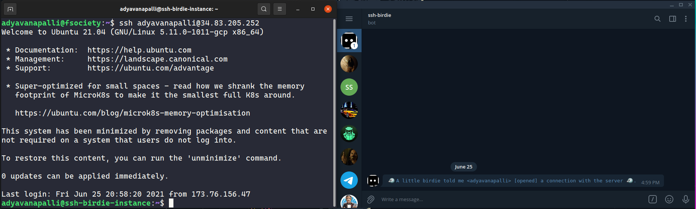

# ssh-birdie

[](https://github.com/adyavanapalli/ssh-birdie/actions/workflows/ci.yml)



## Purpose

A daemon that watches the syslog for SSH connections and sends a message to
Telegram as a bot user detailing the connection.

## Building

To build, simply run:

```bash
$ make

# The output you should see:
gcc -Wall -Wextra -Wpedantic -I include/ -O3 -c src/daemon.c -o obj/daemon.o
gcc -Wall -Wextra -Wpedantic -I include/ -O3 -c src/telegram_bot_api_client.c -o obj/telegram_bot_api_client.o -lcurl
gcc -Wall -Wextra -Wpedantic -I include/ -O3 -c src/logger.c -o obj/logger.o
gcc -Wall -Wextra -Wpedantic -I include/ -O3 src/ssh-birdie.c -o bin/ssh-birdie obj/daemon.o obj/telegram_bot_api_client.o obj/logger.o -lsystemd -lcurl
```

## Configuration

This daemon assumes the `SSH_BIRDIE_TELEGRAM_BOT_API_TOKEN` and
`SSH_BIRDIE_CHAT_ID` environment variables are set.

The `chat_id` associated with `SSH_BIRDIE_CHAT_ID` may be obtained by setting up
a webhook for your bot and messaging your bot inside the direct chat with it.
Telegram will send a POST request to that webhook and the JSON body will contain
a key for the `chat_id`.

## Running

The compiled program is output to `bin/` and you can run it using:

```bash
$ bin/ssh-birdie

# You should see no output.
```

## Logs

`ssh-birdie` logs both informational and error messages to the system log. You
may observe these logs using the `journalctl` command using the `ssh-birdie`
identifier. For example, the following is the log output produced after starting
`ssh-birdie`, SSH'ing into the server, and subsequently killing `ssh-birdie`:

```bash
$ journalctl --identifier=ssh-birdie

-- Journal begins at Fri 2021-06-25 21:12:01 UTC, ends at Fri 2021-06-25 21:13:39 UTC. --
Jun 25 21:12:34 instance ssh-birdie[1220]: Started.
Jun 25 21:12:34 instance ssh-birdie[1220]: fork() returned > 0. Exiting process with successful exit status.
Jun 25 21:12:34 instance ssh-birdie[1221]: Returning from child process.
Jun 25 21:12:34 instance ssh-birdie[1221]: fork() returned > 0. Exiting process with successful exit status.
Jun 25 21:12:34 instance ssh-birdie[1222]: Returning from child process.
Jun 25 21:12:34 instance ssh-birdie[1222]: The program was successfully daemonized.
Jun 25 21:12:34 instance ssh-birdie[1222]: Opened system journal to the sshd identifier.
Jun 25 21:12:50 instance ssh-birdie[1222]: Found new SSH session state change.
Jun 25 21:12:51 instance ssh-birdie[1222]: Sent SSH session notification to Telegram.
Jun 25 21:13:37 instance ssh-birdie[1222]: SIGINT/SIGTERM was caught.
Jun 25 21:13:37 instance ssh-birdie[1222]: Cleaning up.
Jun 25 21:13:37 instance ssh-birdie[1222]: Stopped.
```
